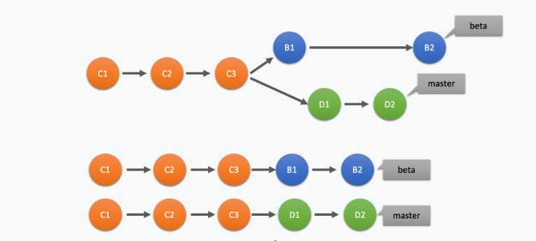

# Git Advance

## 1. Branch

Khi làm việc trong một dự án có nhiều người tham gia, chúng ta thường tách thành nhiều branch và mỗi branch sẽ đảm nhiệm chức năng riêng biệt. Khi code xong thì sẽ được merge vào develop hoặc master.

### 1.1. Tạo mới branch

Câu lệnh dưới đây sẽ tạo một branch mới dựa vào nhánh hiện tại.

```bash
git branch NewBranch
```

Nếu bạn muốn tạo branch mới và đồng thời chuyển sang nhánh mới luôn thì sử dụng câu lệnh:

```bash
git checkout -b NewBranch
// hoặc
git switch -c NewBranch
```

### 1.2. List branches

- **List branches ở local**

```bash
git branch
```

- **List branches ở remote**

```bash
git branch -r
```

- **List branches local và remote**

```bash
git branch -a
```

### 1.3. Đổi tên branch

- Đổi tên nhánh hiện tại:

```bash
git branch -m <ten_nhanh_moi>
```

- Đổi tên nhánh bất kỳ:

```bash
git branch -m <ten_nhanh_cu> <ten_nhanh_moi>
```

### 1.4. Chuyển branch

Chỉ chuyển được nếu các nhánh tồn tại ở local.

```bash
git checkout <ten_branch>

// hoặc

git switch <ten_branch>
```

### 1.5. Push branch

- Nhánh mới tạo

```bash
git push -u origin <ten_nhanh>

// Hoặc

git push -u origin HEAD
// HEAD tham chiếu đến đầu danh sách branch hiện tại
```

### 1.6. Xóa branch

- Xóa ở local

```bash
git branch -D <ten_branch>
```

- xóa ở remote

```bash
git push origin :<ten_branch>
```

Đồng bộ hóa branch, tránh trường hợp đã xóa branch ở remote mà khi gõ **git branch -r** mà branch đó vẫn tồn tại

```bash
git fetch -p
```

## 2. Git Merge



Giả sử chúng ta muốn nhánh **Beta** có những commit của nhánh **Master** thì ta sẽ tiến hành merge **Master** vào **Beta** nên ta thực hiện lệnh

```bash
git checkout Beta
git merge master
```

Ngược lại nếu muốn nhánh **Master** có đầy đủ commits của nhánh **Beta** 
```bash
git checkout master
git merge Beta
```

### 2.1 Giải quyết conflict khi merge 
Nếu trong quá trình merge có bị conflict thì thao tác theo thứ tự

1. Tìm file conflict trong tab source và fix nó.
2. Sau khi fix hết các file bị conflict rồi thì dùng `git add .` hoặc add từng file
3. Tiến hành thêm commit cho những file vừa fix conflict bằng câu lệnh `git merge --continue --no-edit`, nếu muốn edit commit thì `git merge --continue`, còn nếu muốn tự viết commit thì cứ `git commit -m 'thông điệp'` như thường
4. push hết lên với câu lệnh `git push`

Nếu merge xong rồi mới nhận ra mình không cần merge nữa thì có thể dùng `git reset --hard <commit-của bạn-trước-khi-merge>`. Cách này áp dụng cho cả đã push code hay chưa push đều được.


