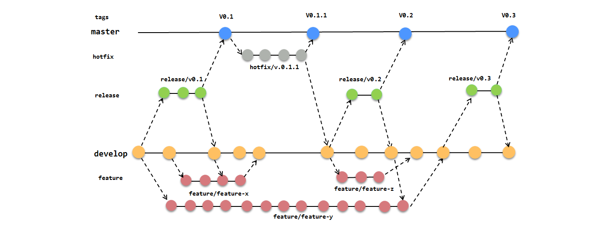

# Git flow 

## 1. Khái niệm Gitflow ?

Gitflow là một mô hình quản lý code trong Git, được phát triển bởi Vincent Driessen. Gitflow cung cấp một cách thức tổ chức và quản lý các nhánh của Git để giúp cho các dự án phần mềm có thể phát triển một cách dễ dàng và hiệu quả hơn.

### 1.1 Các branch chính và chức năng của từng branch

- **Master**: là branch tồn tại xuyên suốt vòng đời của phần mềm được tạo mặc định trong Git khi tạo repository. Và nó chỉ có thể merge vào từ branch release chứ không được code trực tiếp trên branch này. Sản phẩm được đưa lên môi trường production sẽ được lấy tại đây nên code nên code được merge vào branch master phải được quản lý và xử lý cẩn thận.
- **Release**: là branch dùng để release sản phẩm như đúng tên gọi của nó. Nhánh này là nơi các tính năng đã hoàn thành và đang được test, khi test xong thì sẽ được merge vào branch master.
- **Develop**: Nhánh này được checkout từ master, nó được coi là branch trung tâm cho việc phát triển. Mỗi khi có tính năng mới cần xây dựng, thì branch feature sẽ được checkout từ branch này để phát triển. Khi 1 feature xong thì leader sẽ tiến hành merge develop vào nhánh release để cho tester test tính năng đó.
- **Feature**: Nhánh này được checkout từ branch develop. Các feature có thể là feature/login, feature/search ..., sau khi các chức năng này hoàn thành thì sẽ được merge vào develop.
- **Hotfixes**: Nhánh này được checkout từ nhánh master. Để fix nhanh những lỗi ở nhánh master. Sau khi fix xong thì sẽ được merge vào nhánh master.

